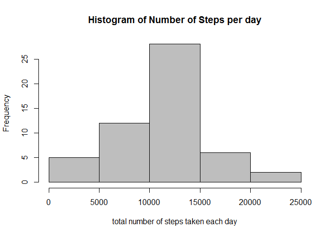
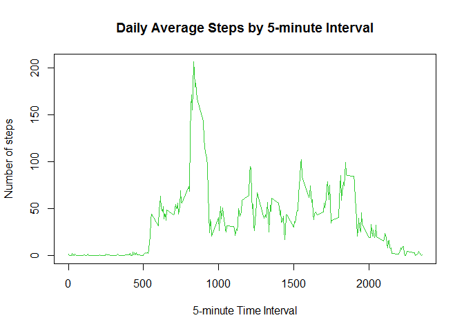
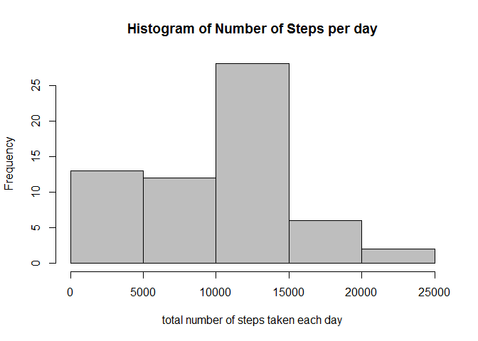
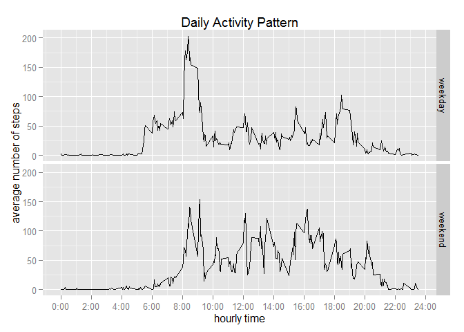
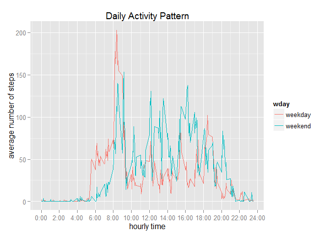

# Reproducible Research: Peer Assessment 1

## Loading and preprocessing the data


```r
df <- read.csv("activity.csv")
head(df)
```

```
##   steps       date interval
## 1    NA 2012-10-01        0
## 2    NA 2012-10-01        5
## 3    NA 2012-10-01       10
## 4    NA 2012-10-01       15
## 5    NA 2012-10-01       20
## 6    NA 2012-10-01       25
```

## What is mean total number of steps taken per day?

For this part of the assignment, you can ignore the missing values in the dataset.

1. Calculate the total number of steps taken per day

2. Make a histogram of the total number of steps taken each day

3. Calculate and report the mean and median of the total number of steps taken per day


```r
# 1
steps.perday <- tapply(df$steps, df$date, sum)
# 2
hist(steps.perday, 
     main = "Histogram of Number of Steps per day", 
     xlab = "total number of steps taken each day", 
     col = "grey")
```

 

```r
# 3
steps.mean <- mean(steps.perday, na.rm=T)
steps.mean
```

```
## [1] 10766.19
```

```r
steps.median <- median(steps.perday, na.rm=T)
steps.median
```

```
## [1] 10765
```

* The mean total number of steps taken per day is **10766** steps.
* The median total number of steps taken per day is **10765** steps.

## What is the average daily activity pattern?

1. Make a time series plot (i.e. type = "l") of the 5-minute interval (x-axis) and the average number of steps taken, averaged across all days (y-axis)


```r
steps.interval<- aggregate(steps ~ interval, data = df, mean, na.rm = TRUE)
plot(steps ~ interval, data = steps.interval, type = "l",
     main = ("Daily Average Steps by 5-minute Interval"), 
     xlab = "5-minute Time Interval",
     ylab = "Number of steps",
     col = "limegreen")
```

 

2. Which 5-minute interval, on average across all the days in the dataset, contains the maximum number of steps?


```r
which.max(steps.interval$steps)
```

```
## [1] 104
```

```r
max.index <- steps.interval[104,1]
max.index
```

```
## [1] 835
```

* Interval **835** contains the maximum number of steps, which means on average, the sample walks most on **08:35 A.M.**

## Imputing missing values

1. Calculate and report the total number of missing values in the dataset (i.e. the total number of rows with NAs)


```r
summary(df)
```

```
##      steps                date          interval     
##  Min.   :  0.00   2012-10-01:  288   Min.   :   0.0  
##  1st Qu.:  0.00   2012-10-02:  288   1st Qu.: 588.8  
##  Median :  0.00   2012-10-03:  288   Median :1177.5  
##  Mean   : 37.38   2012-10-04:  288   Mean   :1177.5  
##  3rd Qu.: 12.00   2012-10-05:  288   3rd Qu.:1766.2  
##  Max.   :806.00   2012-10-06:  288   Max.   :2355.0  
##  NA's   :2304     (Other)   :15840
```

```r
# Alternatively,
NA.total <- nrow(df[is.na(df$steps), ])
NA.total
```

```
## [1] 2304
```

* There are **2304** rows with missing values

2. Fill all of the missing values with the mean for that 5-minute interval across all days

3. Create a new dataset with the missing data filled in.


```r
# recall steps.interval
head(steps.interval)
```

```
##   interval     steps
## 1        0 1.7169811
## 2        5 0.3396226
## 3       10 0.1320755
## 4       15 0.1509434
## 5       20 0.0754717
## 6       25 2.0943396
```

```r
tail(steps.interval)
```

```
##     interval     steps
## 283     2330 2.6037736
## 284     2335 4.6981132
## 285     2340 3.3018868
## 286     2345 0.6415094
## 287     2350 0.2264151
## 288     2355 1.0754717
```

```r
new.df <- merge(df, steps.interval, by = 'interval')
head(new.df)
```

```
##   interval steps.x       date  steps.y
## 1        0      NA 2012-10-01 1.716981
## 2        0       0 2012-11-23 1.716981
## 3        0       0 2012-10-28 1.716981
## 4        0       0 2012-11-06 1.716981
## 5        0       0 2012-11-24 1.716981
## 6        0       0 2012-11-15 1.716981
```

```r
new.df$steps.x[is.na(new.df$steps.x)] <- new.df$steps.y
head(new.df)
```

```
##   interval  steps.x       date  steps.y
## 1        0 1.716981 2012-10-01 1.716981
## 2        0 0.000000 2012-11-23 1.716981
## 3        0 0.000000 2012-10-28 1.716981
## 4        0 0.000000 2012-11-06 1.716981
## 5        0 0.000000 2012-11-24 1.716981
## 6        0 0.000000 2012-11-15 1.716981
```

```r
# remove temporary mean column
new.df$steps.y <- NULL
summary(new.df)
```

```
##     interval         steps.x                date      
##  Min.   :   0.0   Min.   :  0.000   2012-10-01:  288  
##  1st Qu.: 588.8   1st Qu.:  0.000   2012-10-02:  288  
##  Median :1177.5   Median :  0.000   2012-10-03:  288  
##  Mean   :1177.5   Mean   : 32.540   2012-10-04:  288  
##  3rd Qu.:1766.2   3rd Qu.:  1.717   2012-10-05:  288  
##  Max.   :2355.0   Max.   :806.000   2012-10-06:  288  
##                                     (Other)   :15840
```

```r
# rename steps.x back to steps
colnames(new.df)[2] <- "steps"
head(new.df)
```

```
##   interval    steps       date
## 1        0 1.716981 2012-10-01
## 2        0 0.000000 2012-11-23
## 3        0 0.000000 2012-10-28
## 4        0 0.000000 2012-11-06
## 5        0 0.000000 2012-11-24
## 6        0 0.000000 2012-11-15
```

4. Make a histogram of the total number of steps taken each day and Calculate and report the mean and median total number of steps taken per day. Do these values differ from the estimates from the first part of the assignment? 


```r
# The new histogram
new.steps.perday <- tapply(new.df$steps, new.df$date, sum)

hist(new.steps.perday, 
     main = "Histogram of Number of Steps per day", 
     xlab = "total number of steps taken each day", 
     col = "grey")
```

 

```r
# The new and median
new.steps.mean <- mean(new.steps.perday)
new.steps.mean
```

```
## [1] 9371.437
```

```r
new.steps.median <- median(new.steps.perday)
new.steps.median
```

```
## [1] 10395
```

Of course the values differ because this time we increase the denominator up to the total number of observations when calculating the mathematical mean by filling the missing values (at first we use `na.rm = T` to make the denominator smaller by **2304** than the total)

**What is the impact of imputing missing data on the estimates of the total daily number of steps?**

* The mean will be absolutely smaller. 
* The median will be smaller as well because we replace the NA's with relatively smaller number (we can compare the two histograms to see that the number of observations which lie in the zone 0-5000 increases significantly )

## Are there differences in activity patterns between weekdays and weekends?


```r
# Convert Date
new.df$wday <- factor(ifelse(as.POSIXlt(as.Date(new.df$date))$wday%%6 == 0, "weekend", "weekday"))

steps.interal.day = aggregate(steps ~ interval + wday, new.df, mean)

library(ggplot2)
ggplot(aes(x = interval/100, y = steps), data = steps.interal.day) +
  geom_line() + 
  facet_grid(wday ~ .) +
  scale_x_continuous(breaks=seq(0,24,2), labels=paste(0:12*2,":00", sep="")) +
  xlab('hourly time') +
  ylab('average number of steps') +
  ggtitle('Daily Activity Pattern')
```

 

```r
#Alterntively,
ggplot(aes(x = interval/100, y = steps), data = steps.interal.day) +
  geom_line(aes(color = wday) ) + 
  scale_x_continuous(breaks=seq(0,24,2), labels=paste(0:12*2,":00", sep="")) +
  xlab('hourly time') +
  ylab('average number of steps') +
  ggtitle('Daily Activity Pattern')
```

 

